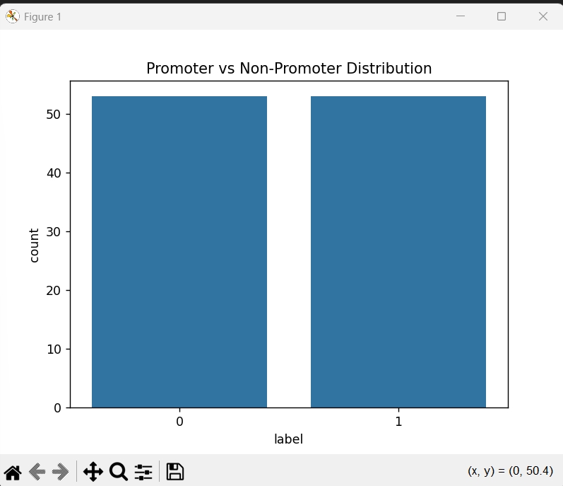

# DNA Promoter Sequence Classification

## Project Overview

DNA may be written in just four letters A, C, G, and T but decoding its regulatory logic is anything but simple.

This project explores the use of machine learning to classify promoter sequences short regulatory regions that determine when genes are switched on.This is a foundational step toward sequence-based modeling inspired by modern regulatory genomics research. By translating nucleotide sequences into numerical representations, I implement a simple yet foundational classification pipeline to better understand how computational models can capture biologically meaningful patterns.

As an aspiring researcher in computational genomics and healthcare ML, this project represents my first step toward sequence-level modeling in regulatory genomics.

Lets begin with understanding a little bit of basics.

##Promoters

A promoter is a region of DNA located near the start of a gene that controls when and how strongly a gene is expressed. Identifying promoter regions is an important problem in bioinformatics and has implications in disease research and genetic regulation.

##Dataset
The dataset used is the UCI Promoter Gene Sequences dataset.
It contains DNA sequences labeled as promoter (+) or non-promoter (-).
Each sequence is 57 nucleotides long.

##Exploratory Data Analysis
The dataset was analyzed for class distribution to evaluate potential imbalance 

The dataset appears approximately balanced, which supports reliable model training.

##Methodology
Label Encoding (+ → 1, - → 0)
DNA Sequence Encoding (A,C,G,T → numerical representation)
Train-Test Split (80/20)
Logistic Regression classifier

##Results
The logistic regression model achieved an accuracy of 77.2% on the test set.
This suggests that even simple linear models can capture positional sequence patterns associated with promoter regions.

##Research

 
